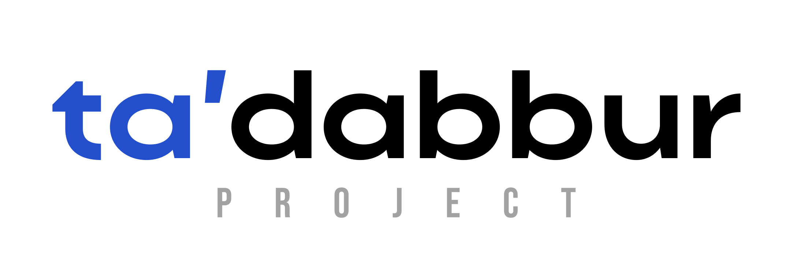

<div align="center">

<h1></h1>
<h3>A Research & Learning Platform for the Muslim World</h3>

<p><em>"Tadabbur" (تدبّر) — to reflect deeply, to ponder with purpose</em></p>

[](https://github.com)
[](CONTRIBUTING.md)
[](LICENSE)

**Built by Muslims. For Muslims. For the entire world.**

[🌐 Website](#) · [📢 Discuss](https://github.com/discussions) · [💰 Donate](https://buymeacoffee.com/muhammadfarman) · [🤝 Contribute](#contributing)

</div>

---

## 🌟 The Vision

Over a thousand years ago, Muslim scholars didn't just memorize texts — they **researched, questioned, synthesized, and built upon knowledge** across theology, philosophy, science, medicine, and mathematics. Ibn Sina mastered medicine *and* Islamic philosophy. Al-Ghazali bridged jurisprudence and spirituality. Ibn Khaldun invented sociology.

**That spirit is missing from Islamic apps today.**

Every Islamic app on the market does the same thing: prayer times, a Quran reader, a Qibla compass. Useful — but shallow.

**Tadabbur is different.** It is not a utility app. It is a full **research and learning platform** — built to give Muslim youth the tools, primary sources, structure, and AI-powered assistance to study Islam the way the Golden Age scholars did: *rigorously, curiously, and comprehensively.*

> Our goal: empower a new generation of Muslim thinkers by 2028.

---

## 🗺️ Roadmap — 6 Parts, One Mission

We are building Tadabbur in **6 progressive phases**, publishing each part as it is complete. This ensures every release is stable, usable, and valuable on its own — while the full platform grows toward its vision.

---

### ✅ Phase 1 — Structured Learning Paths *(Complete)*
> *Not random content. A real curriculum.*

Most Islamic content online is scattered — YouTube videos, PDFs, random articles. There is no structured path from beginner to deep knowledge.

Phase 1 delivers a full **curriculum framework**:
- Beginner → Intermediate → Advanced learning tracks
- Subjects: Aqeedah, Fiqh, Tafsir, Hadith Sciences, Arabic, Islamic History, Ethics & Spirituality
- Rich lesson content with text, images, videos, callouts, and quizzes
- Progress tracking, enrollment, and learning streaks
- RTL Arabic UI with full English/Arabic i18n support
- AI-powered lesson translation (Gemini) into each learner's language
- Resource library and video archive
- Admin panel with curriculum editor, WYSIWYG lesson builder, role-based access, and analytics
- Announcement system for reaching logged-in learners

**Status: Shipped.** The web app is live with browsable curriculum, lesson content, progress tracking, and a full admin authoring system.

---

### 🔄 Phase 2 — Active Learning, Not Passive Reading *(In Progress)*
> *Study. Test. Retain. Repeat.*

Reading is not learning. Phase 2 transforms Tadabbur into an active study tool:

- **Spaced repetition** for memorization of ayat, hadith, and key concepts
- **AI-driven Socratic questioning** — after you read a lesson, the AI asks *you* questions
- **"Teach it back"** — you summarize what you learned; the AI evaluates your understanding
- **Quizzes and milestones** tied to the curriculum from Phase 1

**What we publish:** Interactive lessons with built-in active recall and assessment.

---

### 🤖 Phase 3 — AI Research Assistant *(The Differentiator)*
> *Ask anything. Get answers grounded in authentic scholarship.*

This is what no Islamic app has ever done properly.

- Ask: *"What is the Shafi'i position on this? What does Ibn Kathir say about this ayah?"*
- AI cross-references Quran, Hadith collections, classical scholars, and tafsir automatically
- Every answer is **cited with full sources** — no unattributed opinions
- AI trained and fine-tuned on a verified, authenticated Islamic corpus
- Multilingual support — Arabic, English, Urdu, Indonesian, French, and more

**What we publish:** AI research assistant integrated into the learning platform.

---

### 📚 Phase 4 — Primary Source Access with Context
> *The original texts. Unified. Searchable. Explained.*

Right now, Quran, Hadith, and classical texts exist in silos across dozens of websites. No one has unified them properly.

- Full Quran with word-by-word breakdown, multiple tafsir, and scholarly commentary
- Complete Hadith collections (Bukhari, Muslim, Abu Dawud, Tirmidhi, etc.) with authenticity grading
- Classical texts in translation: Ihya Ulum al-Din, Muqaddimah, Maqasid al-Sharia, and more
- **AI-powered cross-referencing** — find connections across all texts instantly
- Every source linked to its chain of transmission (isnad)

**What we publish:** Unified primary source library with AI search and contextual links.

---

### 🔭 Phase 5 — Interdisciplinary Connections *(The Golden Age Angle)*
> *Show how Islamic scholars connected everything.*

Muslim youth are told Islam and science are in conflict. History proves the opposite.

- Explore how Golden Age scholars connected theology, science, mathematics, philosophy, and medicine
- *"Ibn Sina approached medicine this way — here's the method, here's how it applies today"*
- Modules on Islamic contributions to algebra, optics, astronomy, logic, sociology
- Help learners see Islam as an **intellectually complete civilization**, not a ritual checklist

**What we publish:** Interdisciplinary study modules connecting Islamic history to modern knowledge.

---

### 🌐 Phase 6 — Community & Verification Layer
> *Scholars verify. Communities discuss. Knowledge grows.*

- Verified scholars can review, endorse, and annotate content
- Discussion threads anchored to specific texts and lessons (like GitHub Issues, but for Islamic scholarship)
- Study groups with accountability and peer learning
- Open contribution system — community members can submit lessons, translations, and notes for scholar review
- Transparent moderation: every piece of content shows its review status

**What we publish:** Full community platform with scholar verification and collaborative learning.

---

## 💡 Why Open Source?

Islamic knowledge belongs to the Ummah — not to a company, not behind a paywall.

By making Tadabbur fully open source:

- Muslim developers **worldwide** can contribute code, translations, and content
- Islamic scholars can **verify and contribute** without gatekeepers
- Communities can **self-host** their own instances
- The platform cannot be sold, shut down, or corrupted by commercial interests
- Every improvement benefits every Muslim on earth

This is how we scale: not through venture capital, but through the **global Muslim developer community**.

---

## 🪣 MinIO Setup (File Storage)

Tadabbur uses **MinIO** (S3-compatible object storage) to store lesson images, PDFs, and other uploaded media. MinIO is **not bundled in Docker Compose** — you bring your own. Choose the option that fits you:

---

### Option A — You already have MinIO (or any S3-compatible service)

Just fill in your credentials in `.env`:

```env
MINIO_ENDPOINT=https://s3.yourdomain.com
MINIO_PUBLIC_URL=https://s3.yourdomain.com
MINIO_ACCESS_KEY=your-access-key
MINIO_SECRET_KEY=your-secret-key
MINIO_BUCKET_NAME=tadabbur-media
MINIO_ASSETS_BUCKET=tadabbur-assets
```

> Works with any S3-compatible service: MinIO, AWS S3, Backblaze B2, Cloudflare R2, Wasabi, etc.

---

### Option B — Run MinIO locally with a single Docker command

If you don't have MinIO installed, spin up a standalone instance in seconds:

```bash
docker run -d \
  --name minio-local \
  -p 9000:9000 \
  -p 9001:9001 \
  -e MINIO_ROOT_USER=minioadmin \
  -e MINIO_ROOT_PASSWORD=minioadmin \
  -v minio_data:/data \
  minio/minio server /data --console-address ":9001"
```

Then open the console at **http://localhost:9001** and log in with `minioadmin / minioadmin`.

Your `.env` for this setup:

```env
MINIO_ENDPOINT=http://localhost:9000
MINIO_PUBLIC_URL=http://localhost:9000
MINIO_ACCESS_KEY=minioadmin
MINIO_SECRET_KEY=minioadmin
MINIO_BUCKET_NAME=tadabbur-media
MINIO_ASSETS_BUCKET=tadabbur-assets
```

---

### Option C — Install MinIO binary (no Docker)

**Linux / macOS:**
```bash
# Download
curl -O https://dl.min.io/server/minio/release/linux-amd64/minio
chmod +x minio

# Run
MINIO_ROOT_USER=minioadmin MINIO_ROOT_PASSWORD=minioadmin \
  ./minio server ~/minio-data --console-address ":9001"
```

**Windows:**
```powershell
# Download from https://dl.min.io/server/minio/release/windows-amd64/minio.exe
# Then run:
$env:MINIO_ROOT_USER="minioadmin"
$env:MINIO_ROOT_PASSWORD="minioadmin"
.\minio.exe server C:\minio-data --console-address ":9001"
```

---

### After Setup — Create the Buckets

Once MinIO is running, create the two required buckets and set them to **public read**:

1. Open the MinIO Console (usually **http://localhost:9001**)
2. Go to **Buckets → Create Bucket**
3. Create `tadabbur-media` and `tadabbur-assets`
4. For each bucket: **Manage → Access Policy → Public**

Or use the MinIO CLI (`mc`):

```bash
mc alias set local http://localhost:9000 minioadmin minioadmin
mc mb local/tadabbur-media
mc mb local/tadabbur-assets
mc anonymous set public local/tadabbur-media
mc anonymous set public local/tadabbur-assets
```

---

## 🤝 Contributing

We welcome contributions from Muslim developers, designers, translators, Islamic scholars, and educators worldwide.

### Ways to Contribute

**💻 Developers**
- Frontend (Vue.js 3 / Vite / Tailwind CSS)
- Backend (Django 5 / Django REST Framework)
- AI/ML (LLM fine-tuning, RAG pipelines for Islamic texts)
- Mobile (React Native — planned Phase 2)

**🌍 Translators**
- Arabic, Urdu, Indonesian, Malay, Turkish, French, Bengali, Swahili, and more

**📖 Islamic Scholars & Educators**
- Curriculum review and content verification
- Writing and reviewing lesson content
- Flagging inaccuracies

**🎨 Designers**
- UI/UX design
- Illustrations and visual learning assets

### Getting Started

```bash
# Clone the repo
git clone https://github.com/mohhomadfarman/tadabbur.git
cd tadabbur

# Copy environment template and fill in your values
cp .env.example .env

# Start all services (frontend, backend, MongoDB, Redis, MinIO)
docker compose -f docker-compose.dev.yml up --build
```

Read [CONTRIBUTING.md](CONTRIBUTING.md) for the full setup guide, workflow, and contribution guidelines.

---

## 💰 Support This Project

Tadabbur is free, open source, and built for the Ummah. We run on community support — no venture capital, no ads, no data selling.

Your donation funds:
- Server and infrastructure costs
- AI model training and API costs
- Paying contributors for specialized work (translations, scholar reviews)
- Full-time development to hit the 2028 milestone

### Donate

| Platform | Link |
|----------|------|
| 💳 Open Collective | *Coming soon* |
| ☕ Buy Me a Coffee | [Donate here](https://buymeacoffee.com/muhammadfarman) |
| 🌙 LaunchGood | *Coming soon* |
| ₿ Crypto | *Coming soon* |

> Every dollar is a sadaqah jariyah — ongoing charity that benefits millions of Muslims seeking knowledge.

---

## 🏗️ Tech Stack

| Layer | Technology |
|-------|-----------|
| Frontend | Vue.js 3 (Composition API), Vite, Tailwind CSS, PrimeVue, Pinia |
| Backend | Django 5, Django REST Framework |
| Auth | Custom JWT via PyJWT (MongoEngine-compatible) |
| Database | MongoDB via MongoEngine ODM |
| File Storage | MinIO (S3-compatible, self-hosted) |
| Task Queue | Celery + Redis |
| Reverse Proxy | Nginx |
| Containers | Docker + Docker Compose |

---

## 📊 Progress

| Phase | Status | Completed |
|-------|--------|-----------|
| Phase 1 — Structured Learning Paths | ✅ Complete | 2026 |
| Phase 2 — Active Learning | 🟡 In Development | — |
| Phase 3 — AI Research Assistant | ⬜ Planned | — |
| Phase 4 — Primary Source Library | ⬜ Planned | — |
| Phase 5 — Interdisciplinary Connections | ⬜ Planned | — |
| Phase 6 — Community & Verification | ⬜ Planned | — |

---

## 🌍 Who Is This For?

- **Muslim youth** who want more than surface-level Islamic knowledge
- **Students** who can't access traditional Islamic scholarship in their country
- **Converts** building their Islamic knowledge from the ground up
- **Researchers** who need unified access to primary Islamic sources
- **Educators and scholars** who want a platform to reach the next generation
- **Anyone** curious about Islamic intellectual tradition

---

## 📜 Guiding Principles

1. **Authenticity first** — every piece of content is grounded in Quran, Sunnah, and verified scholarship
2. **Active over passive** — we build tools for thinking, not just reading
3. **Open forever** — this platform will never be paywalled or sold
4. **Scholar-verified** — technology serves scholarship, not the other way around
5. **Global by design** — built for 1.8 billion Muslims across every language and culture

---

## 📬 Contact & Community

- **GitHub Discussions:** [Join the conversation](#)
- **Discord:** [JOIN HERE](https://discord.gg/RfCn2nU2F)
- **Email:** [mohhomadfarman@gmail.com](mailto:mohhomadfarman@gmail.com)

---

## 📄 License

Tadabbur is released under the [MIT License](LICENSE). Free to use, fork, and build upon — forever.

---

<div align="center">

*"Read! In the name of your Lord who created."*
— Quran 96:1, the first revelation

**The first word revealed was a command to learn.**
**Let's honor that.**

⭐ Star this repo to support the mission · 🔁 Share with Muslim developers worldwide

</div>
